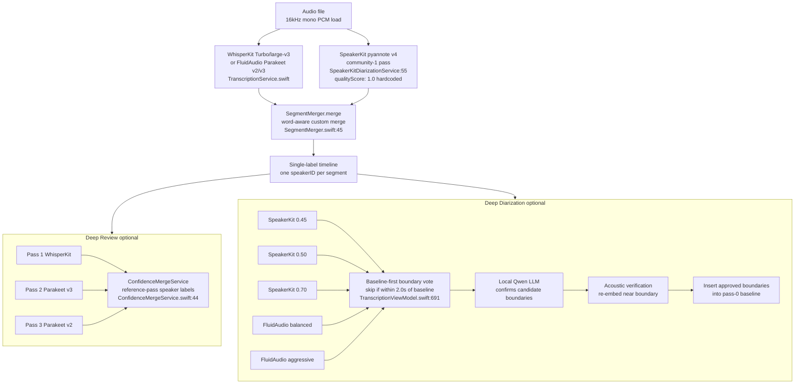
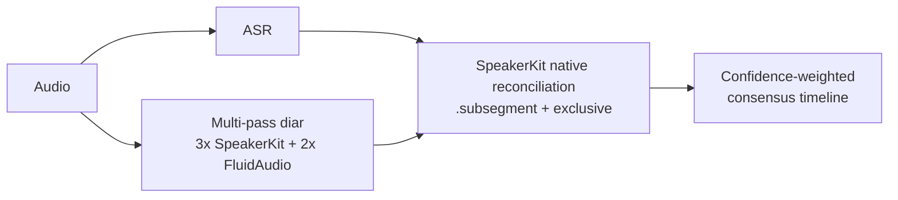
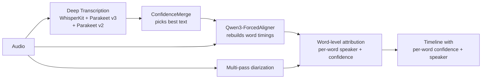
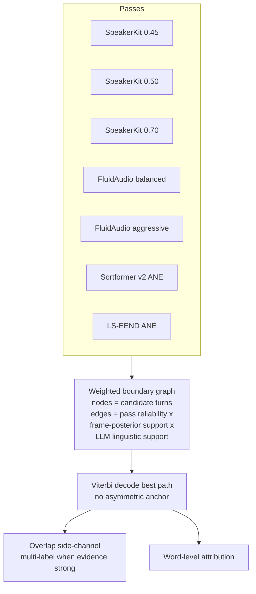
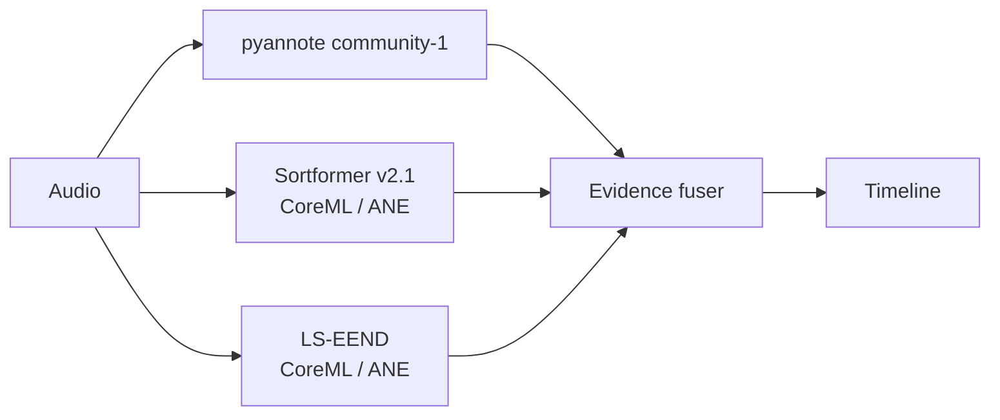
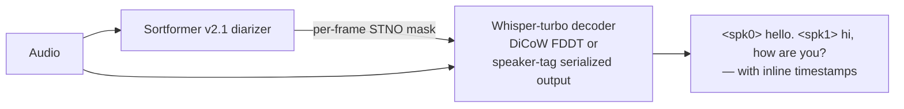
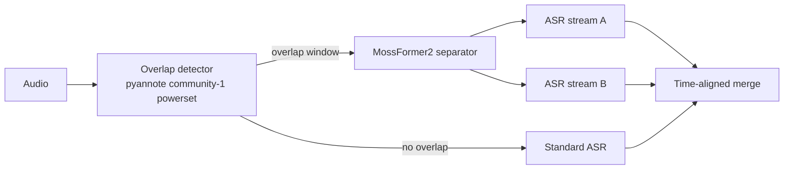
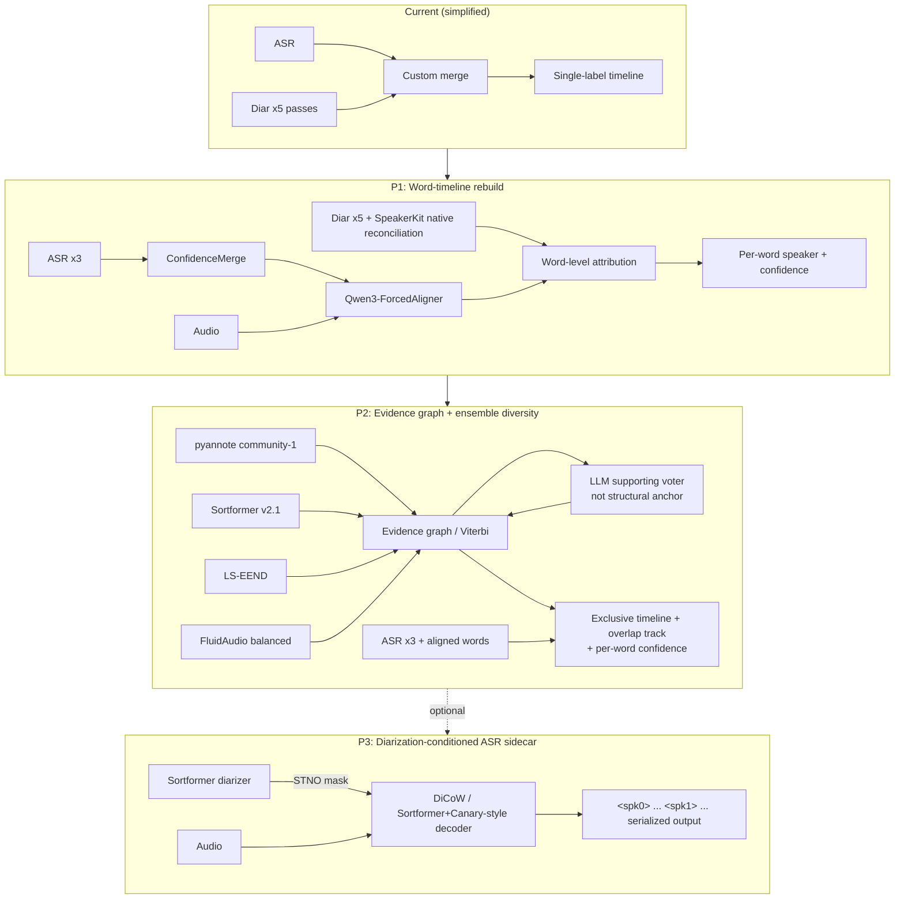

# Performance Memo: Transcription and Diarization

**Prepared:** April 16, 2026
**Author:** Claude (Opus 4.7), synthesizing three parallel research passes
**Companion documents:**
- `Brainstorming/2026-04-16 - Codex Brainstorming.md` — the Codex/ChatGPT exploration I'm responding to
- `DIARIZATION_IMPROVEMENT_GUIDE.md` — earlier (March 2026) pipeline reference
- `IMPROVEMENT-IDEAS.md` — broader product ideas

---

## 0. Executive Summary

The single most important finding: **Consensus is one forced-alignment stage and one diarizer swap away from a genuinely competitive local pipeline, and both moves are Apple-Silicon-native in 2026.**

The cascaded design (transcribe → diarize → merge) is *not* the ceiling — it's the fact that within the cascade we (a) never rebuild word timings after choosing the best text, (b) treat the first diarization pass as ground truth, (c) hardcode diarization confidence to 1.0, and (d) collapse everything to one speaker per region. Those are fixable inside the current architecture.

Beyond those near-term fixes, the 2025–2026 research has converged on three larger patterns: **powerset overlap-aware segmentation** (shipping in pyannote community-1 already), **end-to-end diarizers with arrival-time output** (Sortformer, LS-EEND — CoreML ports exist), and **diarization-conditioned ASR** (DiCoW, Sortformer+Canary serialized tags — the moonshot). I recommend pursuing #1 and #2 immediately and treating #3 as a Deep Review sidecar research track.

**Three-phase recommendation preview** (details in §8):

| Phase | Effort | Expected ceiling lift | What it is |
|---|---|---|---|
| **P1** | 2–4 weeks | Medium-large | Quick-wins: SpeakerKit `.subsegment` + `useExclusiveReconciliation`, forced-alignment stage (Qwen3-ForcedAligner), real per-segment diarization confidence, Parakeet-v3 as a second ASR engine |
| **P2** | 1–2 months | Large | Architectural: evidence-graph Deep Diarization fusing all passes, LS-EEND + Sortformer v2.1 added to the diarizer ensemble, word-level posterior attribution, overlap-aware dual timeline |
| **P3** | 3+ months, research | Very large ceiling | Moonshot: DiCoW-v3 or Sortformer+Canary-style serialized-tag decoding as a Deep Review sidecar |

---

## 1. Current Consensus Architecture

### 1.1 Pipeline diagram



### 1.2 Where the pipeline leaks quality (code-grounded)

| # | Problem | Evidence |
|---|---|---|
| 1 | Pipeline is strictly linear; no back-edges from later passes to re-align earlier stages | [TranscriptionPipeline.swift:17](../TranscriboApp/Transcribo/Services/TranscriptionPipeline.swift#L17) |
| 2 | SpeakerKit diarization segments are tagged `qualityScore: 1.0` — no per-segment confidence, so downstream voting is uniform | [SpeakerKitDiarizationService.swift:63](../TranscriboApp/Transcribo/Services/SpeakerKitDiarizationService.swift#L63) |
| 3 | SpeakerKit only sets `numberOfSpeakers` + `clusterDistanceThreshold`; `useExclusiveReconciliation` and reconciliation strategy are never configured | [SpeakerKitDiarizationService.swift:38-44](../TranscriboApp/Transcribo/Services/SpeakerKitDiarizationService.swift#L38) |
| 4 | Merge collapses overlap: one speakerID per transcription segment, always | [SegmentMerger.swift:45](../TranscriboApp/Transcribo/Services/SegmentMerger.swift#L45) |
| 5 | Deep Diarization is baseline-anchored: candidate boundaries are discarded if within 2s of pass-0 | [TranscriptionViewModel.swift:691-693](../TranscriboApp/Transcribo/ViewModels/TranscriptionViewModel.swift#L691) |
| 6 | Pass agreement is a plain vote count, not a probability or evidence score | [DiarizationService.swift:464-504](../TranscriboApp/Transcribo/Services/DiarizationService.swift#L464) |
| 7 | Confidence merge takes speaker labels entirely from the reference pass, so better text from other engines never improves the speaker timeline | [ConfidenceMergeService.swift:44](../TranscriboApp/Transcribo/Services/ConfidenceMergeService.swift#L44) |
| 8 | No forced-alignment stage anywhere — word timings come from ASR output only, never re-aligned against the final text | (absent from codebase) |
| 9 | No speaker embedding persistence across projects | (absent from codebase) |

Problems #2 and #3 are the fastest wins — both are one-line fixes in the SpeakerKit wrapper if the current API exposes them (§5.1 confirms it does). Problems #4, #5, #7 are architectural. Problem #8 is the single biggest accuracy lever, per the Codex brainstorm *and* the current research (§5.3).

---

## 2. The 2026 Research Landscape (one page)

### 2.1 What changed in the last 12 months

1. **Powerset segmentation** became standard (pyannote 3.x, community-1, DiariZen). Overlap is a first-class output class, not a post-processing afterthought. +11% relative DER over multi-label on benchmarks. ([Plaquet & Bredin, Interspeech 2023](https://hal.science/hal-04233796v1/file/2023___Interspeech___Powerset_speaker_diarization-4.pdf))
2. **End-to-end diarizers closed the gap** with cascaded pipelines. NVIDIA's Sortformer (arrival-time output, no permutation-invariant loss) and Audio-WestlakeU's LS-EEND (streaming, 8 speakers, 1-hour recordings) are now competitive with pyannote community-1 on DIHARD/CALLHOME and dominate it on overlap-heavy sets. Both have CoreML ports.
3. **Diarization-conditioned ASR** went from "speculative" to "has public weights." DiCoW-v3 from BUT-FIT, Sortformer+Canary from NVIDIA, and the USC joint-Whisper paper all ship usable models in 2025–2026.
4. **Apple Silicon ecosystem matured.** `speech-swift` (soniqo) now ships Qwen3-ASR, Parakeet-TDT, Sortformer diarization, and Qwen3-ForcedAligner as SPM modules. FluidAudio added LS-EEND + Sortformer + pyannote 3.1 behind one API. SpeakerKit v0.18 added a proper `ModelManager` abstraction. MLX-Audio runs Qwen3-ASR at or above PyTorch accuracy on M-series.
5. **The "post-Whisper" case is real for English/EU.** Parakeet-TDT-0.6b-v3 hits **6.34% average WER on Open ASR Leaderboard** vs Whisper-v3's ~7.4% at 2.5× smaller — *and produces native word timestamps*. Cohere Transcribe (March 2026) scores 5.42% but has no diarization/timestamps/Swift yet. Qwen3-ASR-1.7B hits LibriSpeech-clean 1.63% WER across 52 languages.

### 2.2 Headline benchmark numbers for context

**Diarization DER (%)** — canonical test sets, official pyannote community-1 card numbers, Sortformer v1 HF numbers, LS-EEND paper numbers, DiariZen aggregated benchmarks:

| Benchmark | pyannote 3.1 | **pyannote community-1** | Sortformer v1 (offline) | Sortformer v2 streaming | LS-EEND | pyannoteAI Precision-2 (cloud) | DiariZen |
|---|---|---|---|---|---|---|---|
| AMI (SDM) | 22.7 | **19.9** | — | — | 20.76 | 15.6 | ~16 |
| DIHARD III | 21.4 | **20.2** | 14.76 | 13.24–18.91 | 19.61 | 14.7 | — |
| VoxConverse v0.3 | 11.2 | **11.2** | — | — | — | 8.5 | — |
| CALLHOME pt2 | 28.5 | **26.7** | 5.85 (2-spk) | 10.70 (full) | 12.11 | 16.6 | — |
| AliMeeting ch1 | 24.5 | **20.3** | — | — | — | 15.2 | — |

Caveats: Sortformer capped at 4 speakers with DER per speaker-count bucket; Precision-2 is cloud/paid; DiariZen uses NC weights. LS-EEND CALLHOME number is the streaming setting — it's the current best *online* DER. Open benchmarks are not strictly apples-to-apples across collar/overlap conventions. ([pyannote/speaker-diarization-community-1 HF card](https://huggingface.co/pyannote/speaker-diarization-community-1), [Sortformer HF card](https://huggingface.co/nvidia/diar_sortformer_4spk-v1), [LS-EEND arXiv:2410.06670](https://arxiv.org/abs/2410.06670), [Lanzendörfer & Grötschla benchmarking paper, arXiv:2509.26177](https://arxiv.org/html/2509.26177v1))

**ASR WER (%)** — Open ASR Leaderboard English average, LibriSpeech for reference:

| Model | Open ASR avg | LibriSpeech clean / other | Native word timestamps | Apple Silicon |
|---|---|---|---|---|
| Whisper large-v3 | ~7.4 | 1.8 / 3.6 | interpolated only | WhisperKit CoreML |
| **Parakeet TDT 0.6b v3** | **6.34** | 1.93 / 3.59 | **yes, native** | FluidAudio + speech-swift |
| Cohere Transcribe 03/2026 | **5.42** | 1.25 / 2.37 | no | MLX community port only |
| Qwen3-ASR 1.7B | n/a | **1.63 / 3.38** | no native word ts | speech-swift (hybrid MLX+CoreML) |
| Qwen3-ASR 0.6B | n/a | 2.11 / 4.55 | no native word ts | speech-swift, MLX-Audio |

Sources: [NVIDIA parakeet-tdt-0.6b-v3 card](https://huggingface.co/nvidia/parakeet-tdt-0.6b-v3), [Qwen3-ASR report on arXiv](https://arxiv.org/html/2601.21337v2), [CohereLabs cohere-transcribe-03-2026 card](https://huggingface.co/CohereLabs/cohere-transcribe-03-2026), [Open ASR Leaderboard](https://huggingface.co/spaces/hf-audio/open_asr_leaderboard).

---

## 3. Design Principles for the Redesign

Before evaluating alternatives, the principles that should govern any change:

1. **Keep the local-first, privacy-first contract.** No cloud, no telemetry. This rules out pyannoteAI Precision-2 (cloud) and Argmax Pro SDK as default paths, even though both are stronger than anything open.
2. **No dependencies with non-commercial licenses in the shipping path.** This rules out DiariZen weights (CC-BY-NC), Sortformer v1 offline (CC-BY-NC), WavLM-Large-ECAPA (murky license). Sortformer v2+ (CC-BY-4.0) and Parakeet (CC-BY-4.0) are fine.
3. **Preserve Deep Review as the product's spine.** The multi-engine comparison and LLM-assisted boundary confirmation are genuinely distinctive features. Don't collapse them into a single model.
4. **Measure before optimizing.** The app has no benchmark harness. Any architectural change needs to land alongside a repeatable eval (AMI subset + a handful of user-donated legal/meeting recordings with ground-truth RTTM).
5. **Fail gracefully.** A new diarizer should enter the ensemble as a voter, not as a replacement, until it has proved itself on the benchmark set.

---

## 4. Architecture Options Considered

I considered six distinct architectures. For each I include a diagram and an honest trade-off assessment.

### 4.1 Option A — Status quo, refinements only

No architectural change. Fix the bugs from §1.2: turn on SpeakerKit's `useExclusiveReconciliation` + `.subsegment` reconciliation, propagate real confidence, and stop anchoring Deep Diarization to the first pass.



**Pros:** All changes land inside existing files. Fast. Low risk. Uses capabilities SpeakerKit already exposes. **Cons:** Doesn't address word-timing quality, doesn't fix overlap, doesn't fix baseline anchoring.

**Effort:** ~1 week. **Expected DER lift:** small-to-moderate (1–3 DER points mostly from the native reconciliation switch and confidence-weighted voting).

### 4.2 Option B — Word-timeline rebuild (Codex pick #1, my pick for P1)

Insert a **forced-alignment stage** after Deep Transcription picks the final text. Rebuild word timings against the audio using `Qwen3-ForcedAligner-0.6B` via `speech-swift`. Then run word-level speaker attribution against cleaned diarization.



**Why this is the single highest-leverage P1 change:** the brainstorm is right that Consensus is time-axis-limited more than model-limited. Our ASR outputs word timestamps, but WhisperKit word timings are cross-attention-derived (inherently noisy) and Parakeet word timings are native (much better) but can disagree with Whisper by 50–200ms at turn boundaries. When word timings are wrong, *every* downstream layer — merge, Deep Diarization boundary insertion, Deep Review disagreement clustering, subtitle export — compounds the error.

Qwen3-ForcedAligner is Apache-2.0, 11 languages, already shipping in `speech-swift` as a CoreML/MLX hybrid module, and the upstream MLX-Audio project reports it surpasses WhisperX/NFA/Monotonic-Aligner. ([Qwen/Qwen3-ForcedAligner-0.6B HF card](https://huggingface.co/Qwen/Qwen3-ForcedAligner-0.6B), [speech-swift README](https://github.com/soniqo/speech-swift))

A related, smaller bet: **Whisper's internal cross-attention aligner** (DTW over cross-attention maps) has been shown in [Yeh et al., arXiv:2509.09987](https://arxiv.org/abs/2509.09987) to *outperform* the external wav2vec2 aligner WhisperX uses. WhisperKit already has the cross-attention tensors in hand; extracting them is cheaper than a separate model. Worth A/B-testing against Qwen3-ForcedAligner.

**Effort:** 2–4 weeks (model integration + wiring into existing `ConfidenceMergeService`). **Expected lift:** large for edge timing precision; small-to-moderate for overall WER; moderate-to-large for DER-at-turn-boundaries.

### 4.3 Option C — Evidence-graph Deep Diarization (Codex pick #2, my pick for P2)

Replace the current "insert boundaries missed by baseline" logic with a full **evidence-graph** over time: every boundary candidate from every pass becomes a node; edges carry pass reliability, local acoustic score, optional LLM-support signal. Decode the best speaker path via Viterbi rather than editing pass 0.



**Why this is transformational:** today the system's answer is "pass 0 unless the LLM and ≥1 other pass overrule it." An evidence graph turns the system's answer into "whichever timeline has the most aggregate support." This is how state-of-the-art diarization research systems reason about uncertainty — MISP 2025's overlap-adaptive hybrid winner ([Huang et al., Interspeech 2025](https://www.isca-archive.org/interspeech_2025/huang25k_interspeech.pdf)) is essentially this pattern applied to two pipelines; we'd be applying it to five-plus.

The natural byproduct is **overlap as a first-class output** (Codex #4). When two speakers have strong evidence in the same frame, the graph decoder can emit both on a separate overlap track rather than forcing one to win.

This also unblocks **real confidence propagation** (Codex #3): the decoder's path probability becomes a natural per-boundary and per-word confidence score we can surface in the UI.

**Effort:** 1–2 months. **Expected lift:** large; this is the move that changes what Deep Diarization *is*, not just what it does better.

### 4.4 Option D — Swap the diarizer: Sortformer v2.1 + LS-EEND ensemble

Keep the cascade but upgrade the diarizers. Replace (or supplement) pyannote community-1 with an ensemble that includes **Sortformer v2.1 streaming** (CC-BY-4.0, 4-speaker cap, meeting-optimized) and **LS-EEND** (up to 8 speakers, 1-hour recordings, retention-based streaming). Both have CoreML ports shipping today via FluidAudio.



**Why:** Sortformer's Sort Loss is a genuinely different inductive bias from pyannote's clustering-based approach — the ensemble-diversity argument for Consensus (already in place with 3× SpeakerKit + 2× FluidAudio) benefits from *architectural* diversity, not just threshold diversity. [FluidAudio reports ~127× RTF for streaming Sortformer on M2 ANE](https://github.com/FluidInference/FluidAudio/blob/main/Documentation/Benchmarks.md), so inference cost is negligible. LS-EEND covers the >4-speaker case where Sortformer caps out.

Important license discipline: Sortformer v1 offline is **CC-BY-NC** — do not ship. Sortformer v2 / v2.1 streaming are **CC-BY-4.0** — fine for commercial.

**Effort:** 1–2 weeks if we stay on FluidAudio's wrapper; ~1 month if we bring in the models directly. **Expected lift:** moderate (3–5 DER points on hard sets once combined with better fusion per §4.3).

### 4.5 Option E — Diarization-conditioned ASR (the DiCoW / Sortformer+Canary moonshot, P3)

This is the radical direction. Rather than cascade ASR → diarization → merge, build a decoder that consumes diarization directly and emits speaker-tagged tokens in one pass.

Two concrete implementations with public weights as of April 2026:

**E1. DiCoW-v3-MLC** (BUT-FIT, HF [`BUT-FIT/DiCoW_v3_MLC`](https://huggingface.co/BUT-FIT/DiCoW_v3_MLC)): 1.0B params on top of `whisper-large-v3-turbo`, CC-BY-4.0. Consumes a Silence/Target/Non-target/Overlap (STNO) mask per frame from the diarizer and applies Frame-Level Diarization-Dependent Transformations during encoding. On MLC-SLM dev set it goes from baseline **76.1% tcpWER → 28.4% → 20.8% fine-tuned**, with 70.7% → 14.9% on Indian English. ([Polok et al., arXiv:2501.00114](https://arxiv.org/abs/2501.00114)) ([BUT-FIT/DiCoW_v3_MLC HF card](https://huggingface.co/BUT-FIT/DiCoW_v3_MLC))

**E2. Sortformer + Canary Serialized-Tag Decoding**: NVIDIA's pattern emits `<spk0>`, `<spk1>` tags inline with Canary ASR tokens, trained with ordinary token-level cross-entropy (no PIT). LibriSpeechMix 2-mix WER 4.61% vs baseline 6.55% (30% rel.), 3-mix 9.05% vs 12.14% (25% rel.), at +0.78% runtime overhead. ([Sortformer paper arXiv:2409.06656v3](https://arxiv.org/html/2409.06656v3))



**Why it's the moonshot:** every cascade loses at the seams. DiCoW/SOT end-to-end systems address the seams directly — their tcpWER numbers on overlap-heavy benchmarks are the strongest numbers in any of the research I collected.

**Why it's not P1 or P2:**

1. No CoreML/MLX ports exist. Whisper-v3-turbo has MLX ports; grafting on DiCoW's FDDT modifications requires real model-surgery work (weeks of porting, not days).
2. DiCoW's official pipeline uses DiariZen (CC-BY-NC) as the upstream diarizer. For shipping Consensus we'd need to substitute pyannote community-1 or Sortformer v2.1 at the diarizer stage — plausible but another engineering lift.
3. Fine-tuning is where most of the DiCoW gains live (28.4% → 20.8%). Shipping the pretrained model would get us to "better than baseline Whisper on overlap," not "SOTA."
4. The Sortformer+Canary variant sidesteps FDDT modeling by just expanding Canary's vocabulary with `<spk>` tokens — *much* simpler to replicate on top of WhisperKit by fine-tuning a small LoRA. This is the more pragmatic moonshot path.

**Effort:** 3+ months sidecar research, parallel to product work. **Expected lift:** potentially very large on overlap-heavy conversational audio; uncertain on clean monologue.

### 4.6 Option F — Overlap-triggered separation branch

Detect overlap windows, route them through an on-device separator (MossFormer2 or ToTaToNet), transcribe per-source, merge back.



**Why I deprioritize this:** the 2024–2025 research has largely *moved away* from separation-first for conversational audio. MossFormer2 and TF-GridNet beat SepFormer on WSJ0-2mix clean splices but generalize poorly to real reverberant meetings with variable speaker counts. The community's answer to that artifact problem is DiCoW-style conditioning (§4.5), not better separators. No CoreML ports exist for MossFormer2 on Apple Silicon — that alone is 1–2 weeks of ONNX conversion work with unclear payoff.

**If we ever do want this**, the right time is after Option C (we'd have overlap detection as a first-class signal already) and the right deployment is as an opt-in "overlap rescue" pass during Deep Review, not as a default pipeline stage.

---

## 5. Substrate Choices (Models and Libraries)

### 5.1 SpeakerKit — what to turn on immediately

The API already exposes the fields we need; we just don't use them. In `SpeakerKitDiarizationService.swift:38`:

```swift
var options = PyannoteDiarizationOptions()
// Add:
options.useExclusiveReconciliation = true
// If/when SpeakerKit exposes a reconciliation-mode enum:
// options.reconciliationMode = .subsegment
```

And stop hardcoding `qualityScore: 1.0` at line 63 — map from whatever per-segment confidence SpeakerKit exposes (if none, compute from segment length × model-pass agreement). Even a naive derived confidence is better than a constant.

Also: SpeakerKit v0.18 (April 2026) introduced breaking changes — `SpeakerKitDiarizer` replaces `SpeakerKitModelManager`, `modelFolder: URL → String`, lazy-loading via `load: Bool` on `SpeakerKitConfig`. Our current integration is on an older version. Updating absorbs the rename and opens access to newer reconciliation features.

### 5.2 ASR engine choices

| Engine | Role | Rationale |
|---|---|---|
| Whisper large-v3 / Turbo (WhisperKit) | Keep as breadth/language champion | 99 languages, strongest on accented English, proven ANE integration |
| **Parakeet TDT 0.6b v3** (FluidAudio) | **Promote to primary for English/EU** | Native word timestamps, 6.34 WER vs Whisper 7.4, 2.5× smaller, 190× RTF on M4 Pro |
| Parakeet TDT 0.6b v2 | Keep as English-only recall pass | Different training mix than v3 → useful disagreement signal in Deep Review |
| Qwen3-ASR 0.6B (via speech-swift) | **Add as Deep Review third voice** | 52 languages, 1.63 WER on LibriSpeech-clean at 1.7B, 0.6B is laptop-practical |
| Cohere Transcribe 03/2026 | Defer | No Swift, no diarization, no timestamps, MLX community port only |

Keeping three or four engines in the Deep Review fuser is the *right* architecture — each has uncorrelated error modes (Whisper attention-drift hallucinations, Parakeet over-compression on soft speech, Qwen3 multilingual-transfer artifacts). Disagreement is information.

### 5.3 Diarization engine choices

| Engine | Role | License | Apple Silicon |
|---|---|---|---|
| pyannote community-1 (SpeakerKit) | Keep as workhorse | CC-BY-4.0 | CoreML ships in SpeakerKit |
| **Sortformer v2.1 streaming** | **Add as ANE-native end-to-end voter** | CC-BY-4.0 | FluidAudio CoreML, 127× RTF on M2 |
| **LS-EEND** | **Add for >4-speaker content** | Apache-2.0 code, research weights | FluidAudio CoreML |
| Sortformer v1 offline | ❌ Do not ship | CC-BY-NC | — |
| DiariZen | ❌ Do not ship | CC-BY-NC weights | — |
| pyannoteAI Precision-2 | ❌ Cloud | — | — |

### 5.4 Forced aligner

**Qwen3-ForcedAligner-0.6B** (via speech-swift) is the clear winner. Apple Silicon-native, Apache-2.0, 11 languages, outperforms WhisperX wav2vec2 in Qwen's own reporting. Backup: **Whisper internal cross-attention DTW alignment** ([arXiv:2509.09987](https://arxiv.org/abs/2509.09987)) — cheaper, no new model, shown to beat external wav2vec2 in most settings; use as a sanity check against Qwen3 output.

### 5.5 Speaker embeddings (for continuity, not for DER)

Keep **WeSpeaker ResNet34-LM** — it's what pyannote community-1 uses internally, already has an MLX port in `speech-swift`, Apache-2.0. ReDimNet-B6 is a better raw embedder (0.37% EER vs 0.86% on VoxCeleb1-O) but has no CoreML port and changing it would require rewiring clustering. Worth revisiting in ~12 months if a port appears.

The [pyannote voiceprints tutorial](https://docs.pyannote.ai/tutorials/identification-with-voiceprints) is explicit that embeddings improve *identity continuity* across sessions, **not** DER on a single session. Use them for UX (stable speaker names across projects) not accuracy.

### 5.6 Local LLM for post-processing

Stay on `mlx-swift-lm`. Promote from the current default to **Qwen3-4B-4bit MLX** for the sweet spot of speed and reasoning; **Qwen3-8B-4bit** as an optional "higher-effort" Deep Review mode on M3 Max+/M4 Pro+. This is the substrate for LLM-assisted boundary confirmation (already implemented) and for future **DiarizationLM-style post-hoc speaker correction** ([Wang et al., arXiv:2401.03506](https://arxiv.org/abs/2401.03506)) — reported 55.5% rel. WDER reduction on Fisher with a fine-tuned PaLM-2-S, though the SpeakerLM paper warns zero-shot LLM correction degrades performance and fine-tuning is required.

---

## 6. Consolidated Alternative Architectures Diagram



---

## 7. What I'd Measure Before and After

Any of the above changes is worthless without a benchmark harness. The missing piece is a `transcribo-eval` target that:

1. Runs a fixed set of audio files (AMI subset + 5–10 user-donated legal/meeting recordings with hand-corrected RTTM + text ground truth).
2. Reports: WER, CER, **tcpWER** (time-constrained per-speaker WER — the right metric for speaker-attributed transcription), DER, JER, WDER, confusion-between-speakers.
3. Logs per-engine and per-pass to a JSON file we can diff between runs.
4. Ships as a command-line tool so we can run it in CI on every architecture change.

The `SDBench` suite ([arXiv:2507.16136](https://arxiv.org/html/2507.16136v2)) is a reasonable starting point for the public-benchmark piece. tcpWER implementation is available in NVIDIA's `meeteval` library.

Without this, every recommendation in this memo is a hope, not a claim.

---

## 8. Recommended Roadmap

### Phase 1 — Immediate fixes + word timeline (2–4 weeks)

1. Update WhisperKit/SpeakerKit to v0.18+; absorb breaking API changes. (1–2 days)
2. Turn on `useExclusiveReconciliation` and `.subsegment` reconciliation in `SpeakerKitDiarizationService`. Delete the custom `wordAwareMerge` code path once native reconciliation is validated. (3–5 days)
3. Replace hardcoded `qualityScore: 1.0` with derived per-segment confidence (pass-agreement × duration-weighted heuristic, then upgrade to real signal once §5.1's research pans out). (2 days)
4. Integrate `speech-swift`'s Qwen3-ForcedAligner as a post-Deep-Transcription forced-alignment stage. Pipe aligned words into `ConfidenceMergeService`. A/B against Whisper internal cross-attention DTW. (1–2 weeks)
5. Add Parakeet-TDT-v3 as the default Deep Review engine A; Whisper becomes engine B. (2 days — already wired via FluidAudio)
6. Stand up `transcribo-eval` harness with tcpWER/DER/WDER. (3 days)

**Phase 1 exit criterion:** measurable improvement on the benchmark set (>= 2 DER points, >= 1 tcpWER point) or we stop and re-plan.

### Phase 2 — Evidence graph and ensemble diversity (1–2 months)

1. Add Sortformer v2.1 streaming (FluidAudio CoreML) to the diarizer ensemble. (1 week)
2. Add LS-EEND (FluidAudio CoreML) for >4-speaker content. (1 week)
3. Replace `refineSpeakers` baseline-anchored boundary insertion with an evidence-graph Viterbi decoder that fuses all passes. (3–4 weeks)
4. Introduce an overlap side-channel (second parallel timeline) for frames where the evidence graph indicates strong multi-speaker support. Update the transcript model and SwiftUI to render overlap segments distinctly. (2 weeks)
5. Wire per-word confidence through to export formats (PDF highlighting, SRT color-coding).

**Phase 2 exit criterion:** DER on AMI-SDM subset below 18%; tcpWER on legal benchmark below 15%.

### Phase 3 — Diarization-conditioned ASR research sidecar (3+ months)

Parallel research track; not blocking Phase 1/2.

1. Prototype Sortformer-diarizer + WhisperKit-LoRA-with-`<spk>`-tokens. This is the cheapest DiCoW-family experiment — no FDDT surgery, just vocabulary expansion and supervised fine-tuning on synthetic speaker-tagged Whisper training data. (4–6 weeks)
2. Alternative prototype: MLX port of DiCoW-v3-MLC's 1.0B weights, with pyannote community-1 front-end replacing DiariZen. (4–6 weeks)
3. Evaluate against Phase 2 on the hardest overlap-heavy recordings. Only merge into production if the sidecar beats Phase 2 by a clear margin on the benchmark set *and* doesn't regress on clean monologue.

---

## 9. Near-Term Actionable Next Step

If you only do one thing this month, do this: **land Phase 1 items 1–4 and the eval harness**. The forced-alignment stage alone is likely to move the needle visibly on the legal-hearing recordings, and the eval harness is the prerequisite for every further decision.

If you can do two things, add **Sortformer v2.1 streaming** to the ensemble (Phase 2 item 1). It's two weeks of engineering for a CC-BY-4.0 end-to-end diarizer that runs at 127× RTF on ANE and brings architectural diversity the ensemble currently lacks.

---

## Appendix A — Full Citation List

### Diarization research
- [Plaquet & Bredin, "Powerset multi-class cross entropy loss for neural speaker diarization", Interspeech 2023](https://hal.science/hal-04233796v1/file/2023___Interspeech___Powerset_speaker_diarization-4.pdf)
- [pyannote/speaker-diarization-community-1 (HF card with DER tables)](https://huggingface.co/pyannote/speaker-diarization-community-1)
- [pyannote community-1 release blog (pyannote.ai)](https://www.pyannote.ai/blog/community-1)
- [pyannote-audio GitHub](https://github.com/pyannote/pyannote-audio)
- [pyannote STT + diarization tutorial](https://docs.pyannote.ai/tutorials/speech-to-text-diarization)
- [pyannote confidence scores tutorial](https://docs.pyannote.ai/tutorials/confidence-scores)
- [pyannote voiceprints tutorial](https://docs.pyannote.ai/tutorials/identification-with-voiceprints)
- [Park et al., "Sortformer", arXiv:2409.06656](https://arxiv.org/abs/2409.06656)
- [Sortformer paper v3 full text](https://arxiv.org/html/2409.06656v3)
- [nvidia/diar_sortformer_4spk-v1 HF card](https://huggingface.co/nvidia/diar_sortformer_4spk-v1)
- [nvidia/diar_streaming_sortformer_4spk-v2 HF card](https://huggingface.co/nvidia/diar_streaming_sortformer_4spk-v2)
- [nvidia/diar_streaming_sortformer_4spk-v2.1 HF card](https://huggingface.co/nvidia/diar_streaming_sortformer_4spk-v2.1)
- [Medennikov et al., "Streaming Sortformer", arXiv:2507.18446](https://arxiv.org/abs/2507.18446)
- [NVIDIA Streaming Sortformer developer blog](https://developer.nvidia.com/blog/identify-speakers-in-meetings-calls-and-voice-apps-in-real-time-with-nvidia-streaming-sortformer/)
- [Park et al., "Multi-scale Diarization Decoder (MSDD)", arXiv:2203.15974](https://arxiv.org/pdf/2203.15974)
- [Liang & Li, "LS-EEND", arXiv:2410.06670](https://arxiv.org/abs/2410.06670)
- [Audio-WestlakeU/FS-EEND GitHub (LS-EEND official impl)](https://github.com/Audio-WestlakeU/FS-EEND)
- [Landini et al., "DiaPer", arXiv:2312.04324](https://arxiv.org/abs/2312.04324)
- [Broughton et al., "Pushing the Limits of End-to-End Diarization", Interspeech 2025](https://www.isca-archive.org/interspeech_2025/broughton25_interspeech.pdf)
- [O-EENC-SD, arXiv:2512.15229](https://arxiv.org/abs/2512.15229)
- [Kalda et al., "PixIT / ToTaToNet", Odyssey 2024](https://github.com/joonaskalda/PixIT)
- [Huang et al., "Overlap-Adaptive Hybrid Speaker Diarization for MISP 2025", Interspeech 2025](https://www.isca-archive.org/interspeech_2025/huang25k_interspeech.pdf)
- [SpeakerLM, arXiv:2508.06372](https://arxiv.org/html/2508.06372v1)
- [SDBench, arXiv:2507.16136](https://arxiv.org/html/2507.16136v2)
- [Lanzendörfer & Grötschla, "Benchmarking Diarization Models", arXiv:2509.26177](https://arxiv.org/html/2509.26177v1)
- [BUTSpeechFIT/DiariZen GitHub](https://github.com/BUTSpeechFIT/DiariZen)
- [Yakovlev et al., "ReDimNet", Interspeech 2024](https://www.isca-archive.org/interspeech_2024/yakovlev24_interspeech.pdf)
- [WeSpeaker toolkit GitHub](https://github.com/wenet-e2e/wespeaker)

### Diarization-conditioned ASR and joint models
- [Polok et al., "DiCoW", arXiv:2501.00114](https://arxiv.org/abs/2501.00114)
- [BUTSpeechFIT/DiCoW GitHub](https://github.com/BUTSpeechFIT/DiCoW)
- [BUT-FIT/DiCoW_v3_MLC HF](https://huggingface.co/BUT-FIT/DiCoW_v3_MLC)
- [SE-DiCoW, arXiv:2601.19194](https://arxiv.org/abs/2601.19194)
- [DiCoW+SOT hybrid, arXiv:2510.03723](https://arxiv.org/abs/2510.03723)
- [End-to-End Joint ASR and Speaker Role Diarization, arXiv:2601.17640](https://arxiv.org/abs/2601.17640)
- [TS-SUPERB, arXiv:2505.06660](https://arxiv.org/html/2505.06660)
- [SQ-Whisper, arXiv:2412.05589](https://arxiv.org/html/2412.05589v1)
- [t-SOT, arXiv:2202.00842](https://arxiv.org/abs/2202.00842)
- [SA-SOT, arXiv:2403.02010](https://arxiv.org/abs/2403.02010)
- [Scaling Multi-Talker ASR w/ Activity Streams, arXiv:2510.03630](https://arxiv.org/html/2510.03630v1)
- [DiarizationLM, arXiv:2401.03506](https://arxiv.org/abs/2401.03506)
- [LLM-Diarize-ASR-Agnostic, arXiv:2406.04927](https://arxiv.org/abs/2406.04927)

### Forced alignment
- [Yeh et al., "Whisper Has an Internal Word Aligner", arXiv:2509.09987](https://arxiv.org/abs/2509.09987)
- [Qwen/Qwen3-ForcedAligner-0.6B HF](https://huggingface.co/Qwen/Qwen3-ForcedAligner-0.6B)
- [NeMo Forced Aligner docs](https://docs.nvidia.com/nemo-framework/user-guide/latest/nemotoolkit/tools/nemo_forced_aligner.html)
- [WhisperX GitHub](https://github.com/m-bain/whisperX)

### Speech separation
- [Zhao et al., "MossFormer2", arXiv:2312.11825](https://arxiv.org/abs/2312.11825)
- [alibabasglab/MossFormer2 GitHub](https://github.com/alibabasglab/MossFormer2)
- [TF-Locoformer, MERL TR2024-126](https://merl.com/publications/docs/TR2024-126.pdf)

### ASR models and Apple Silicon
- [nvidia/parakeet-tdt-0.6b-v3 HF card](https://huggingface.co/nvidia/parakeet-tdt-0.6b-v3)
- [QwenLM/Qwen3-ASR GitHub](https://github.com/QwenLM/Qwen3-ASR)
- [Qwen3-ASR Technical Report arXiv:2601.21337](https://arxiv.org/html/2601.21337v2)
- [moona3k/mlx-qwen3-asr](https://github.com/moona3k/mlx-qwen3-asr/)
- [CohereLabs/cohere-transcribe-03-2026 HF](https://huggingface.co/CohereLabs/cohere-transcribe-03-2026)
- [WhisperKit paper, arXiv:2507.10860](https://arxiv.org/html/2507.10860v1)
- [argmaxinc/WhisperKit GitHub](https://github.com/argmaxinc/WhisperKit)
- [soniqo/speech-swift GitHub](https://github.com/soniqo/speech-swift)
- [FluidInference/FluidAudio GitHub](https://github.com/FluidInference/FluidAudio)
- [FluidAudio Benchmarks.md](https://github.com/FluidInference/FluidAudio/blob/main/Documentation/Benchmarks.md)
- [FluidInference/diar-streaming-sortformer-coreml HF](https://huggingface.co/FluidInference/diar-streaming-sortformer-coreml)
- [FluidInference/parakeet-tdt-0.6b-v3-coreml HF](https://huggingface.co/FluidInference/parakeet-tdt-0.6b-v3-coreml)
- [Blaizzy/mlx-audio GitHub](https://github.com/Blaizzy/mlx-audio)
- [Blaizzy/mlx-audio-swift GitHub](https://github.com/Blaizzy/mlx-audio-swift)
- [ml-explore/mlx-swift-examples GitHub](https://github.com/ml-explore/mlx-swift-examples)
- [senstella/parakeet-mlx GitHub](https://github.com/senstella/parakeet-mlx)
- [Open ASR Leaderboard HF Space](https://huggingface.co/spaces/hf-audio/open_asr_leaderboard)

### Conversational audio foundation models
- [Kimi-Audio, arXiv:2504.18425](https://arxiv.org/abs/2504.18425)
- [MoonshotAI/Kimi-Audio GitHub](https://github.com/MoonshotAI/Kimi-Audio)
- [Qwen2-Audio, arXiv:2407.10759](https://arxiv.org/abs/2407.10759)

### Challenges and benchmarks
- [USTC-NERCSLIP CHiME-8, arXiv:2409.02041](https://arxiv.org/abs/2409.02041)
- [CHiME-8 NOTSOFAR-1 Task 2 Results](https://www.chimechallenge.org/challenges/chime8/task2/results)
- [NOTSOFAR-1 challenge summary, arXiv:2501.17304](https://arxiv.org/html/2501.17304v1)
