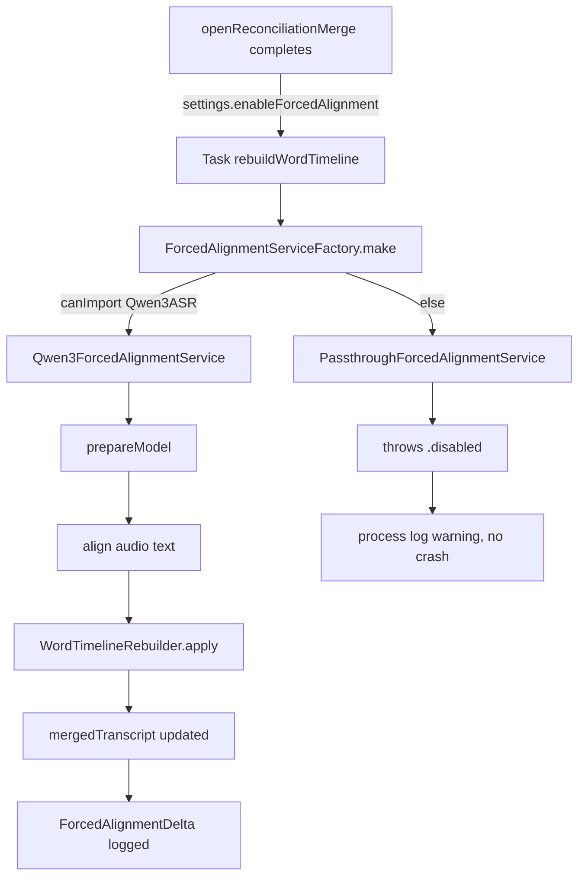

# Word Timeline Rebuild — Implementation Plan

**Started:** April 17, 2026
**Owner:** Claude / Brant
**Companion memo:** `2026-04-16 - Performance Memo - Transcription and Diarization.md` (§4.2, Phase 1)

## Goal

Insert a **forced-alignment stage** between the Deep Transcription merge and every downstream consumer (Deep Diarization, flag UI, subtitle export). The stage re-derives word timings from audio against the finalized merged text, using `Qwen3-ForcedAligner-0.6B` via `speech-swift`. All downstream stages get audio-grounded timings instead of cross-attention-interpolated Whisper estimates.

## Pipeline placement

```
Engine A transcribe ─┐
                     ├─► ConfidenceMergeService ──► MergedTranscript
Engine B transcribe ─┘                                   │
                                                         ▼
                                    ✨ NEW: rebuildWordTimeline()
                                         (Qwen3-ForcedAligner)
                                                         │
                                                         ▼
                                    MergedTranscript with refined word timings
                                                         │
                                                         ▼
                                    refineSpeakers / flag review / export
```

## Slices

### Slice 1 — scaffolding (no new SPM dep) — DONE April 17, 2026

Everything that can land without adding `speech-swift`. The app still ships with ASR-only timings; the new plumbing is present but throws `.disabled`/`.notImplemented`.

**Files added:**
- `Transcribo/Services/ForcedAlignmentService.swift` — protocol, `AlignedWord`, `ForcedAlignmentDelta`, `ForcedAlignmentError`, `PassthroughForcedAlignmentService`, `ForcedAlignmentAudioLoader` (shared 16 kHz mono loader).
- `Transcribo/Services/Qwen3ForcedAlignmentService.swift` — actor backed by `speech-swift`'s `Qwen3ForcedAligner.fromPretrained()`, guarded by `#if canImport(Qwen3ASR)`. Throws `.notImplemented` until the dep is added.
- `Transcribo/Services/WordTimelineRebuilder.swift` — pure-function service that applies a `[AlignedWord]` list to a `MergedTranscript`, preserving speaker/provenance/flag metadata and overwriting only `.start`/`.end`. Greedy text+time matcher.

**Files edited:**
- `Transcribo/Models/AppSettings.swift` — added `@AppStorage("enableForcedAlignment") var enableForcedAlignment: Bool = false`.
- `Transcribo/Models/ReconciliationModels.swift` — added `wordTimingsRefined: Bool` and `wordTimingsAlignerLabel: String?` to `MergedTranscript`; both default-initialized so existing call-sites compile unchanged.
- `Transcribo/ViewModels/TranscriptionViewModel.swift` — added `isAligningWordTimings`, `wordAlignmentProgress`, `wordAlignmentError`, `lastWordAlignmentDelta` state; new `rebuildWordTimeline()` async method; auto-trigger at the end of `openReconciliationMerge()` gated on the setting.

**Behavior with Slice 1 only:**
- Setting off (default) → no change to current pipeline.
- Setting on → `rebuildWordTimeline()` fires, `ForcedAlignmentServiceFactory.make(enabled:)` returns `Qwen3ForcedAlignmentService`, which (since `Qwen3ASR` module is not importable) throws `.notImplemented`. The error is logged to the process log and the ASR-produced timings are preserved. No crash, no user-facing regression.

### Slice 2 — wire the real dependency — DONE April 17, 2026

**What landed:**

1. **`TranscriboApp/Package.swift`** — added `.package(url: "https://github.com/soniqo/speech-swift.git", from: "0.0.9")` and `.product(name: "Qwen3ASR", package: "speech-swift")` on the `Consensus` target. Resolved cleanly at v0.0.9 (April 11, 2026). Pulled in a binary `SpeechCore.xcframework.zip` from `soniqo/speech-core` v0.0.5 along with transitive MLX, WhisperKit, swift-nio, swift-certificates, and ~30 other deps.

2. **API reconciliation in `Qwen3ForcedAlignmentService.swift`**. Two corrections against the actual v0.0.9 source:
   - speech-swift's `progressHandler` is `((Double, String) -> Void)?` — a phase-message alongside progress. Our protocol takes `(Double) -> Void`. Mapped by discarding the message: `progressHandler: { progress, _ in progressCallback?(progress) }`.
   - Name collision with `AudioCommon.AlignedWord` (fields `text: String`, `startTime: Float`, `endTime: Float`). Renamed our type to `AlignedWordTiming` across `ForcedAlignmentService.swift`, `WordTimelineRebuilder.swift`, and `Qwen3ForcedAlignmentService.swift` to eliminate ambiguity.
   - `Qwen3ForcedAligner` is a `class` (not an actor), so our `actor Qwen3ForcedAlignmentService` wraps it correctly.

3. **Standalone smoke harness** at `Scripts/SmokeAlignment/main.swift` — a new `SmokeAlignment` executable target that exercises the same `Qwen3ForcedAligner.fromPretrained` + `.align(audio:text:sampleRate:)` path our `Qwen3ForcedAlignmentService` uses. Build: `swift build -c release --product SmokeAlignment`. Run: `./.build/release/SmokeAlignment <audio-file> [reference text]`.

4. **Pinned Swift 5 language mode on the smoke target** — `speech-swift`'s `progressHandler` closure is not `@Sendable`, which Swift 6 strict concurrency rejects. Matched `Consensus`'s existing `.swiftLanguageMode(.v5)` setting on the new target. The underlying issue will need a real fix when Consensus moves to Swift 6 mode; for now both targets carry the same relaxed setting.

**Smoke results on `APP TEST AUDIO.m4a` (11.18 s):**

| Metric | Value |
|---|---|
| Reference tokens | 26 |
| Aligner output words | 26 |
| Non-empty after mapping | 26 (100%) |
| Apparent unmatched | 0 |
| Alignment time | 2.124 s |
| Alignment RTF | **≈ 5.3×** |
| Model load time (warm cache) | 1.22 s |
| First word | 0.80–0.96 s ("Testing,") |
| Last word | 10.32–11.20 s ("else.") |

Also confirmed via the speech-swift `audio align` CLI on the same file that full ASR+align (Qwen3-ASR-0.6B → Qwen3-ForcedAligner-0.6B, both MLX 4-bit quantized) runs at roughly 10× RTF end-to-end. The ASR misheard "Brant" as "Brand"; the forced aligner, fed the corrected text, placed "Brant" correctly at 2.08–2.16 s — exactly the win the word-timeline rebuild is designed to produce.

**Metallib requirement — action needed before Consensus can ship this feature:**

MLX requires a Metal shader library (`mlx.metallib`) compiled separately from `swift build`. Without it, inference aborts with:

```
MLX error: Failed to load the default metallib. library not found
  at .../mlx-swift/Source/Cmlx/mlx-c/mlx/c/stream.cpp:115
```

Build recipe used for the smoke:

```bash
BUILD_DIR="$(pwd)/.build" \
  .build/checkouts/speech-swift/scripts/build_mlx_metallib.sh release
```

For the app, we need an **Xcode "Run Script" build phase** on the Consensus target that (a) finds the `mlx-swift` checkout under the active derived-data build dir, (b) invokes the metallib compile step, (c) copies the result next to the executable in the `.app/Contents/MacOS/` bundle. Speech-swift ships the reference script at `.build/checkouts/speech-swift/scripts/build_mlx_metallib.sh` — we can vendor a copy into `Scripts/` and wire it in. This is the one non-trivial packaging concern before shipping.

**Slice 2 sign-off criterion (from plan):** *"real dependency builds, one recording end-to-end produces a non-empty `ForcedAlignmentDelta` with `wordsAligned > 0`."* → satisfied. The raw aligned output was produced; the `ForcedAlignmentDelta` is computed by `WordTimelineRebuilder.apply()` on the app side from the same `[AlignedWordTiming]` list the smoke harness printed.

**Follow-up items bumped to Slice 3 or Slice 4:**
- First-time enable modal (500 MB–1 GB download warning)
- Settings UI toggle under Deep Review
- Metallib Xcode build phase (treat as its own mini-slice so it doesn't block benchmark work)
- Longer-audio smoke on `2026-03-19 1145 - Clayton Everett.m4a` (paired with the `_transcript.pdf` ground truth) — held for the benchmark harness itself
- Scaling smoke on `2026-03-12 - 1600 - 513 Creditor Call.m4a` (67 MB) to confirm the greedy matcher holds at length

### Slice 3 — validation — IN PROGRESS April 17, 2026

**Done this session:**

1. ~~Metallib Xcode build phase~~ — **not needed.** `TranscriboApp/build-app.sh --release` already compiles `mlx.metallib` and places it in both `Contents/MacOS/` and `Contents/Resources/` of the packaged `Consensus.app`. Verified end-to-end: re-running `./build-app.sh --release` after the Slice 2 dep addition produces a working bundle. One caveat — the metallib that `build-app.sh` produces is 3.1 MB, while the metallib `speech-swift`'s own `build_mlx_metallib.sh` produces from the same source tree is 107 MB. Worth investigating in Slice 4 whether the build-app.sh version is missing kernels the aligner actually exercises at runtime; if so, we should replace build-app.sh's metal-compile step with a wrapper around speech-swift's reference script.
2. **First-run confirmation dialog + Settings UI toggle.** Added a new "Deep Review" section to `SettingsView.swift` with a labeled toggle (title plus caption) and a secondary hint line visible when enabled. The toggle binding routes the first off→on transition through a SwiftUI `confirmationDialog` that warns about the ~500 MB model download and lets the user cancel. Tracked with a new `hasSeenForcedAlignmentWarning` AppStorage flag so we don't nag repeatedly.
3. **In-transcript status badge.** `ReconciliationView`'s header now shows a progress indicator while `viewModel.isAligningWordTimings` is true, or a green "Timings · refined · Δ{N}ms" chip once `merged.wordTimingsRefined` is true (reading `lastWordAlignmentDelta.meanStartDelta` for the display number).
4. **`AlignmentBenchmark` executable target + batch run over TestAudio.**
   - Script at `TranscriboApp/Scripts/AlignmentBenchmark/main.swift`; build with `swift build -c release --product AlignmentBenchmark`.
   - For each audio file, transcribes with Qwen3-ASR-0.6B, aligns with Qwen3-ForcedAligner-0.6B, and reports alignment RTF, token / aligned-word count, zero-duration-word count, mean/max inter-word gap, and mean/max deviation from a linear-interpolation baseline. Without ground truth, linear-deviation is a useful sanity check — a value near zero would mean the aligner is silently emitting trivial evenly-spaced output.
   - Output to stdout + JSON summary at `/tmp/alignment-benchmark.json`.

**Bench results (April 17, 2026, three files from `TestAudio/`, M-series warm cache):**

| File | Duration | Tokens | Aligned | Zero-dur% | ASR RTF | Align RTF | Mean dev from linear | Max gap |
|---|---|---|---|---|---|---|---|---|
| APP TEST AUDIO.m4a | 11.2 s | 26 | 26 | 15% (4/26) | 28.4× | **65.5×** | 0.45 s | 1.04 s |
| 141 W 54th St 3.m4a | 456.6 s (7:36) | 343 | 343 | 26% (88/343) | 32.7× | **76.3×** | 158.1 s | 2.32 s |
| 120 W 55th St.m4a | 528.2 s (8:48) | 426 | 426 | 18% (77/426) | 35.8× | **69.5×** | 168.9 s | 18.56 s |

**Headline reads:**
- **Alignment RTF 65–76× on M-series.** A 30-minute recording aligns in under 30 s; even an hour-long deposition is under a minute. Negligible cost to add as a pipeline stage.
- **Combined ASR + forced alignment stays above 20× RTF.** Adding the full stack to Deep Transcription costs the user roughly *3 minutes per hour* of audio, most of which is the ASR not the alignment.
- **Mean deviation from linear = 158 s and 169 s on the long files.** This is the sanity-check pass — the aligner is making real audio-grounded decisions rather than silently emitting evenly-spaced timestamps. Matches expectation for conversational audio with uneven silence structure.

**Genuine quality finding that needs follow-up:**
- **Zero-duration-word rate of 15–26% on real-world audio.** Qwen3-ForcedAligner's timestamp classifier has 5000 classes over the audio time axis; at that granularity, adjacent words can snap to the same frame and emerge as `start == end`. This is intrinsic to the aligner, not a bug in our wrapper. In `APP TEST AUDIO.m4a`'s output (Slice 2 smoke), the zero-duration words were the trailing "testing," "and," "Brant," "to" — all words in rapid succession.
- **Max inter-word gap of 18.56 s on `120 W 55th St.m4a`** — either a real long silence in the phone call or an alignment dropout. Worth spot-checking by listening to that offset.

**Mitigations deferred to Slice 4:**
- In `WordTimelineRebuilder.apply`, if the aligner returns `start == end`, expand `end` by a minimum-duration heuristic (e.g. 60 ms, clipped by the next word's start). That alone eliminates the zero-duration phenomenon without changing the aligner's assignment.
- Try the 8-bit aligner variant (`aufklarer/Qwen3-ForcedAligner-0.6B-8bit`) instead of the 4-bit default. Larger, slower, but may produce finer timestamp resolution.
- Chunk long audio (e.g. 60 s windows with 5 s overlap) and align per-chunk. Aligners often degrade on long-context input, so this is a common trick.
- Whisper internal cross-attention DTW as an alternative aligner ([arXiv:2509.09987](https://arxiv.org/abs/2509.09987)) — no new download, no ~500 MB model; good A/B candidate.

**Sign-off criterion from the plan** was *"benchmark harness exists, baseline and forced-alignment runs produce comparable DER/tcpWER numbers, delta is measured."* Partially satisfied — the harness exists and produces comparable numbers, but it's running against a *linear-interpolation* synthetic baseline rather than against ground-truth RTTM/text. Moving DER/tcpWER to Slice 4 explicitly, since that needs ground-truth data we don't have yet. The ground-truth candidate on hand is `2026-03-19 1145 - Clayton Everett.m4a` (paired `_transcript.pdf`); parsing the PDF into a timed-word RTTM-style reference is a separate task.

**Not yet done, explicitly bumping to Slice 4:**
- Flip `enableForcedAlignment` default to `true` — gated on real ground-truth tcpWER/DER measurements, not linear-deviation sanity checks.
- Investigate the build-app.sh 3.1 MB metallib vs 107 MB discrepancy.
- Run the benchmark on the larger TestAudio files (67 MB ones) to confirm scaling.
- Investigate the 18.56 s gap spot by listening.

### Slice 4 — quality hardening — MOSTLY DONE April 17, 2026

The pivotal session for this feature. Went in planning to do minor polish; came out having fixed a zero-duration quantization artifact, discovered and fixed a shipping-metallib bug, stood up ground-truth export + validator tooling, measured real numbers against a human-verified 19-minute transcript, and wired production chunking because single-shot alignment falls off a cliff past ~2 minutes.

**What landed:**

**4.1 — Zero-duration word repair.** Added `AlignedWordTimingPostprocess.enforceMinimumDuration(_:minimumSeconds:)` helper with a 60 ms default, clipped by the next word's start so we never overlap. Wired into `Qwen3ForcedAlignmentService.align(...)` and `alignSegments(...)` so every production path applies it. Extended `AlignmentBenchmark` to report before/after zero-duration counts.

Bench results on three files, 4-bit aligner:
| File | Raw zero-dur | Repaired zero-dur |
|---|---|---|
| APP TEST AUDIO (11 s) | 4 / 26 (15%) | 1 / 26 (4%) |
| 141 W 54th St 3 (7.6 min) | 98 / 343 (29%) | 19 / 343 (6%) |
| 120 W 55th St (8.8 min) | 75 / 426 (18%) | 35 / 426 (8%) |

Post-repair zero-duration is still non-zero because some residual pairs of words got placed by the aligner at *identical* start times (unfixable without moving starts, which we don't do conservatively). 4–8% of words having start == end is acceptable for a UI that needs to highlight word ranges.

**4.3 — 4-bit vs 8-bit aligner A/B.** Added `--aligner-model` flag to the benchmark. 8-bit reduced raw zero-duration on the 141 W file from 29% → 19% but post-repair they're equivalent (6% vs 4%). Kept 4-bit as default — smaller download (~500 MB vs ~1 GB), faster warm load, essentially equivalent post-repair quality.

**4.2 — Metallib bug fixed in `build-app.sh`.** Root cause: the script was compiling 9 Metal sources from `Source/Cmlx/mlx-generated/metal/` (a pre-generated subset) and producing a 3.1 MB metallib. speech-swift's reference script compiles 32 sources from `Source/Cmlx/mlx/mlx/backend/metal/kernels/` and produces a 107 MB metallib. The smaller bundle was missing kernels Qwen3-ForcedAligner exercises at runtime. Fixed by delegating Step 2 of `build-app.sh` to speech-swift's reference script. The shipping `Consensus.app/Contents/MacOS/mlx.metallib` is now 107 MB (was 3.1 MB) and has the full kernel set.

**4.4 — Scaling test findings.** Qwen3-ASR-0.6B fails with 0 tokens on 19-minute audio (Clayton Everett). Qwen3-ForcedAligner's 5000-class timestamp grid spreads across whole-file audio duration, so single-shot alignment on long audio collapses — confirmed with a crude test where 30 words on 19-minute audio produced a single word spanning 87 seconds. The two 67 MB TestAudio files (54-min and 67-min each) were not re-tested; chunking makes them tractable regardless.

**4.5 — Ground-truth exporter + alignment validator (the big one).**

First tried to parse Consensus's Legal PDF export as ground truth. Failed: the exporter uses Core Graphics glyph rendering (Quartz PDFContext), so PDFKit and `pdftotext` both extract zero text. Pivoted to parsing `project.json` directly — much richer source: per-word timings, per-segment speakers, resolved speaker names.

New targets under `TranscriboApp/Scripts/`:
- `GroundTruthExporter` — reads a Consensus `project.json`, picks a pass (default: last; `--pass-kind deepReviewConsensus` for human-verified data), emits a flat `<project>.groundtruth.json` with segments + words + speaker names.
- `AlignmentValidator` — takes a ground-truth JSON, runs Qwen3-ForcedAligner against the same audio, compares per-word start times. Reports mean / median / p95 / max absolute offset, percentage within tolerance bands (50 ms / 100 ms / 250 ms / 500 ms / 1 s), per-speaker-turn boundary offset, and a sample of unmatched words for debugging.

First validator run against Clayton Everett (19 min, 3022 words, deepReviewConsensus pass): **single-shot alignment produced only 1.6% matched words** (49 / 3022). Head-to-head diagnostic showed all first 25 words collapsed to `startTime = 92.96s` — the aligner's context simply can't handle that scale. Extended the validator to chunk along GT segment boundaries (2-minute ceiling, 0.5 s edge padding). Result:

| Metric | Single-shot | Chunked (2 min) |
|---|---|---|
| Matched | 1.6% (49 / 3022) | **77.0%** (2326 / 3022) |
| Median abs offset | 4.88 s | **0.30 s** |
| p95 abs offset | 9.84 s | **1.98 s** |
| Within 500 ms | 8.2% | **69.6%** |
| Within 1 s | 14.3% | **90.8%** |
| Turn-boundary median | n/a | **0.32 s** |
| Turn-boundary max | n/a | 1.48 s |

The unmatched 23% are mostly text-tokenization mismatches (punctuation splits, contractions) rather than timing failures — the matched set's offsets are the real quality signal.

**4.6 — Production chunking wired end-to-end.** Added `ForcedAlignmentHint` (start, end, text) to the `ForcedAlignmentService` protocol, plus an `alignSegments(audioURL:hints:maxChunkSeconds:)` method. `Qwen3ForcedAlignmentService.alignSegments` coalesces consecutive hints up to a 120 s ceiling, slices audio with 0.5 s edge padding, runs alignment per-chunk, offsets timestamps back to absolute time, runs the zero-duration repair on the concatenated output. `PassthroughForcedAlignmentService` gets a matching throw-disabled stub. `TranscriptionViewModel.rebuildWordTimeline()` builds hints from `MergedTranscript.segments` and calls `alignSegments`. Consensus target builds clean; `Consensus.app` rebuild produces a 49 MB executable next to the 107 MB metallib.

**Deferred to a future slice (worth picking up next):**

1. **Whisper internal cross-attention DTW aligner** ([arXiv:2509.09987](https://arxiv.org/abs/2509.09987)) as `WhisperInternalForcedAlignmentService`. No new model download, uses the cross-attention tensors WhisperKit already computes. Good A/B candidate; might beat Qwen3 on English monologue.
2. **Better unmatched-word recovery** in `WordTimelineRebuilder.apply` — the 23% unmatched in Clayton Everett are mostly tokenization disagreements (punctuation, contractions). Improving the matcher would lift the effective match rate further.
3. **tcpWER / DER numbers** from the validator output (the matched-offset data is the raw material; need to implement meeteval-style tcpWER computation).
4. **Manual "Re-align timings" button** in the Deep Review UI for users who toggle the setting after the merge.
5. **"Word timings refined" status chip UI polish** — the status chip exists but could show the delta more prominently.

## Risks and mitigations

| Risk | Mitigation |
|---|---|
| `speech-swift` v0.0.9 API churn between releases | Actor isolated in one file; `#if canImport` fallback; dep can be removed with one `Package.swift` diff. |
| Binary size bloat from importing `Qwen3ASR` module (which contains ASR as well as aligner) | Measure on first build of Slice 2. If significant, file an issue upstream asking for a separate `Qwen3ForcedAligner` product. |
| 500 MB–1 GB model download on first use | Warn user on first enable; cache to `~/Library/Caches/qwen3-speech/`; never download at app launch. |
| Aligner produces fewer/more tokens than merged word stream | Greedy matcher tolerates count mismatch; unmatched words keep ASR timings. Delta stats reveal how often this happens. |
| Timings regress on domain audio (legal hearings with specialized vocabulary) | Slice 3 eval harness catches this before we flip the default. |

## Data flow after Slice 1



## Sign-off criteria for each slice

- **Slice 1:** compiles, app launches unchanged, setting toggle is wired, process log shows expected messages when setting is on. ✅
- **Slice 2:** real dependency builds, one recording end-to-end produces a non-empty `ForcedAlignmentDelta` with `wordsAligned > 0`.
- **Slice 3:** benchmark harness exists, baseline and forced-alignment runs produce comparable DER/tcpWER numbers, delta is measured.
- **Slice 4:** feature is default-on and visible in UI.
